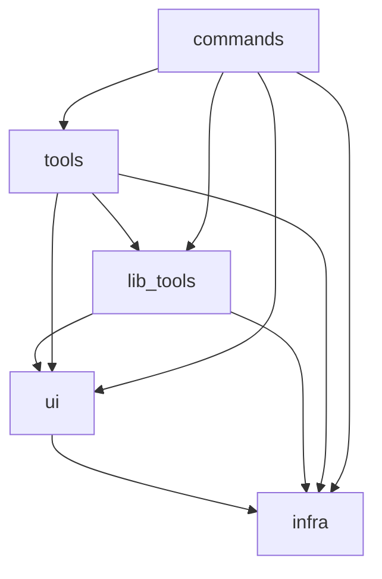

# vim-pytoy 

This is a plugin framework for Vim/Neovim/VSCode
(Personal practice for vim-plugin). 
It focuses on using python tools within vim-buffers. 

## Environment

* Vim9.1+ 
* uv
* python
* pytest
* lightline
* psutil / pydantic / pywinpty
    - `python` is available for the environment these libraries are installed (VIM). 
    - In the specified python environment, these libraries are available (NVIM).  

## Design Overview

### infra
Provides infrastructure for integrating Vim functionality into Python code.

- **`timertasks`**: Allows Python functions to be invoked as Vim timer callbacks (e.g., via `timer_start`).  
- **`vim_function`**: Wraps Python functions as callable Vim functions.  
- **`command`**: Enables defining Vim `:Commands` using Python decorators.

### ui
Provides a unified interface for interacting with UI elements across Vim, Neovim, and VSCode.

- **`ui_enum`**: Detects the current UI environment (e.g., Vim, Neovim, or VSCode).  
- **`windows_utils`**: Unified abstraction for Vim *windows* and VSCode *editors*.  
- **`pytoy_buffer`**: Abstraction layer representing a Vim *buffer* or a VSCode *document*.  
- **`pytoy_quickfix`**: Partial implementation of Vim’s *Quickfix* interface; limited functionality under VSCode.

### lib_tools
Provides reusable utility classes built upon the `infra` and `ui` layers.

- **`buffer_executor`**: Executes shell commands asynchronously and displays their STDOUT/STDERR in a Vim buffer.  
- **`environment_manager`**: Manages virtual environments (e.g., via `uv`).

### tools
Implements actual user-facing tools using the `lib_tools`, `ui`, and `infra` layers (e.g., linters, testers).

- **`pytest`**: Tool integration for Python's `pytest`.  
- **`git`**: Git-related toolset for status, diffs, etc.  
- *...and more.*

### command
Alias for `pytoy.infra.command`, allowing simplified import and intuitive access for users.

### commands
Defines concrete Vim/Neovim commands using `pytoy.command.Command`, exposed to users as native `:Commands`.

---

## Dependency Diagram

### Comments

This is no more than personal hobbies, so do not have any expectation. 

